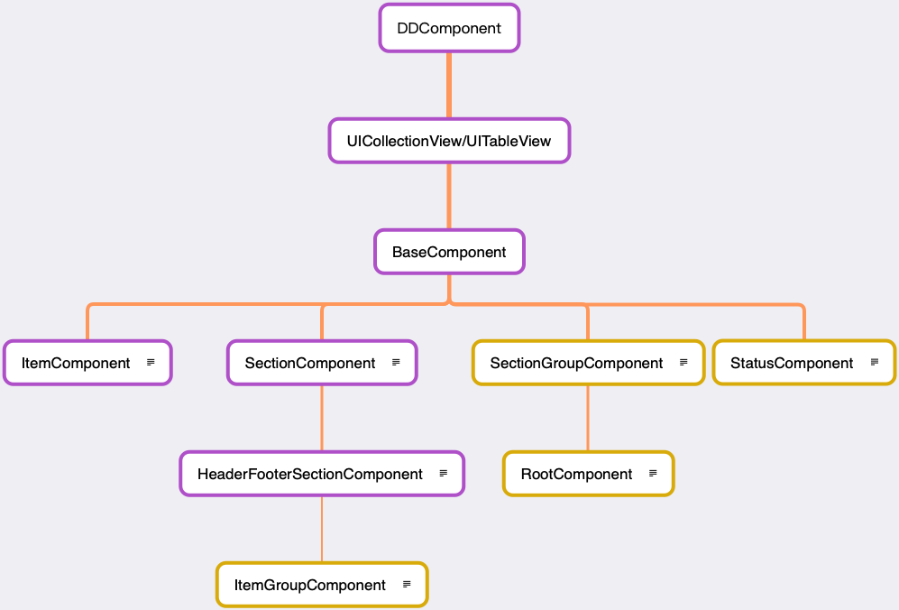
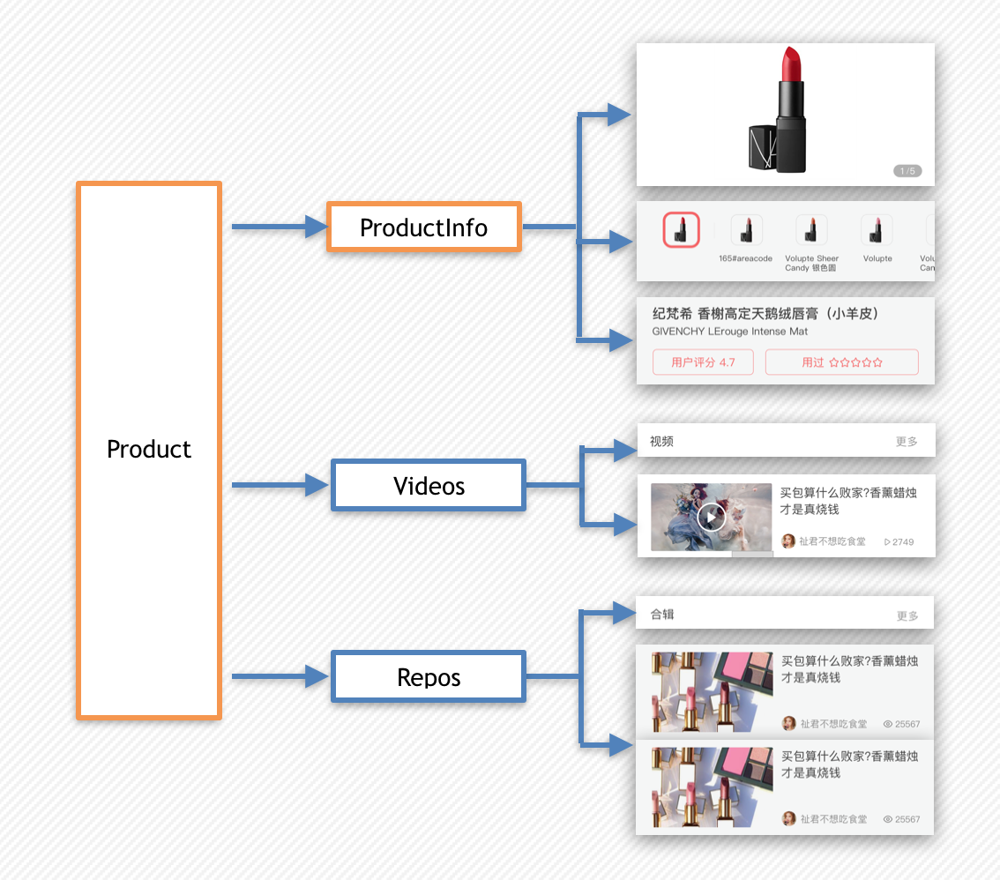
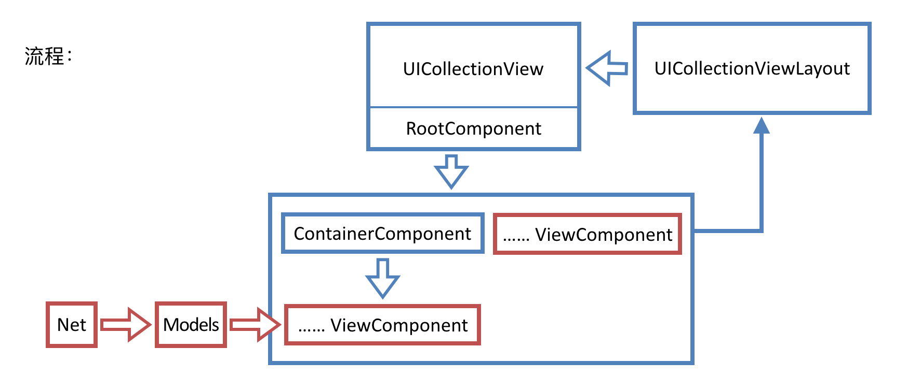

# DDComponent
拆分Collection为多个Component，类似IGList，可以将一个页面的业务拆分为多个模块，是一种模块化业务层的实现。

# 场景

一个页面复杂，内容多而且有明确的业务上的分割，并且有大量内容可以实现复用，如果使用原生CollectionView会产生大量if-else，并且会使Controller非常庞大。初衷是为了拆分Controller，后来在使用过程中用来拆分模块化业务，在目前的使用过程中还是非常的符合我们的业务。

比如淘宝、考拉等以内容为主的平台，模块间相对独立，同时又有很多模块（推荐、相关、评论等）可以完全复用，就非常符合DDComponent的使用场景。和Instagram的`IGList`比较类似，两者分析会在[这篇文章](./CompareToIGList.md)中说明。

# 源码

**可以通过该组件来创建模块比较多比较复杂的UICollectionView 或者tableView布局**
本组件的实现代码采用的是 [djs66256/DDComponent作者](https://github.com/djs66256/DDComponent)的DDComponent [源地址链接](https://github.com/djs66256/DDComponent) 

原作者苍耳 关于组件对用的文章 [【美学的表现层组件化之路】](https://djs66256.github.io/2017/04/09/2017-04-09-美学的表现层组件化之路/)

# 安装

### CocoaPods

```
pod 'DDComponent', :git => 'https://github.com/liuxc123/DDComponent.git', :tag => '1.0.3'
```

# 使用

设计之初考虑到减少学习成本，大部分接口都直接继承于系统接口，如果熟悉`UICollectionView`和`UITableView`编程的马上就能学会。

```objc
@interface YourComponent : DDCollectionViewSectionComponent
@end

@implementation

- (instancetype)init
{
    self = [super init];
    if (self) {
        self.size = CGSizeMake(DDComponentAutomaticDimension, 44);
        // config here. 
        // Remember self.collectionView is nil until it is added to root component.
    }
    return self;
}

- (void)prepareCollectionView {
    [super prepareCollectionView];
    // register your cell here.
}

- (NSInteger)numberOfSectionsInCollectionView:(UICollectionView *)collectionView {
    return 1;
}

- (NSInteger)collectionView:(UICollectionView *)collectionView numberOfItemsInSection:(NSInteger)section {
    return 1;
}

- (CGSize)collectionView:(UICollectionView *)collectionView layout:(UICollectionViewLayout *)collectionViewLayout sizeForItemAtIndexPath:(NSIndexPath *)indexPath {
    return ... // Return your cell
}

@end
```

其他事件均和系统delegate方法一致。

```objc
- (void)collectionView:(UICollectionView *)collectionView didSelectItemAtIndexPath:(NSIndexPath *)indexPath {
    // select item
}
- (void)collectionView:(UICollectionView *)collectionView willDisplayCell:(UICollectionViewCell *)cell forItemAtIndexPath:(NSIndexPath *)indexPath {
    // will display
}
```

# 结构



1. 视图组件： 只负责视图展示，比如一个包含小列表的模块，或者仅仅只有一个元素的模块。只负责职责内的视图展示。
2. 容器组件： 只负责组件间的组合，比如按照顺序或者空态等组合模式，当然最顶层的一个组件也是一个容器类组件。

### ItemComponent

1. 基础组件, 0个section 多个item  需要用容器包裹
2. cell内容内部实现
3. 需使用容器ItemGroupComponent嵌套

### SectionComponent

1. 基础组件, 一个Section 多个items
2. cell、header、footer内容内部实现
3. headerVIew继承此组件
4. footerVIew继承此组件

### HeaderFooterSectionComponent

1. 基础组件, 一个Section 多个items
2. Header以headerComponent为主
3. Footer以footerComponent为主
4. cell内容内部实现

### ItemGroupComponent

1. 容器组件, 一个Section 多个items
2. Header以headerComponent为主
3. Footer以footerComponent为主
4. 子视图以subComponents为主

### SectionGroupComponent

1. 容器组件, 多个Section
2. 子视图subComponents嵌套ItemComponent、SectionComponent、HeaderFooterSectionComponent等容器组件

### RootComponent

1. 根容器组件，绑定collectionView或tableView
2. 多个Section
3. 子视图subComponents嵌套SectionComponent等容器组件

### StatusComponent

1. 状态机容器组件
2. 用与切换Loading、Empty、Normal视图

### FormItemComponent

1. 表单组件，一个View的容器组件  
2. cell不重用



这是一个组装的例子。



实际使用时我们所需要实现的，是视图组件部分，也就是上图红色部分。

# 扩展

如果需要扩展FlowLayout或者CollectionView的功能，增加delegate的方法，仅需要让`容器组件`将该回调传给子组件即可。

# 注意

优先使用属性来配置`size`, `inset`等属性，这样能够更灵活的使用。

# 问题

由于直接采用系统方法，所以`indexPath`代表的是collectionView的位置，并没有一一对应component数据源的`index`，所以使用过程中需要自己来判断数据源的`index`是否就是`indexPath.item`。


